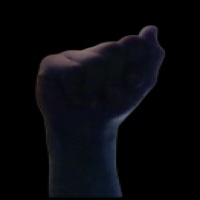

# Definición de los datos

## Origen de los datos

Los datos del abecedario de lengua de señas amaricana fueron descargados del datset de kaggle [ASL Alphabet](https://www.kaggle.com/datasets/grassknoted/asl-alphabet) haciendo uso de la libreria `kaggle` en python que permite autenticarse mediante un token proporcionado por la plataforma y descargar los datos del dataset deseado

## Especificación de los scripts para la carga de datos

Para la obtención de los datos se utilizó el script `scripts/data_acquisition/data_download.py`

## Referencias a rutas o bases de datos origen y destino

Los datos son almacenados en la carpeta `data` del proyecto en su forma sin comprimir y en `data_compressed` en formato `.tar` para ser enviado al almacenamiento remoto mediante DVC. DVC se encuentra conectado a un bucket de GCS donde se almacenan las diferentes versiones de los datos

### Rutas de origen de datos

- [ ] Especificar la estructura de los archivos de origen de los datos.
- [ ] Describir los procedimientos de transformación y limpieza de los datos.

Los datos descargados de Kaggle constan de 2 carpetas, una de entrenamiento con 87.000 imagenes, dividas en grupos de 3000 imagenes para cada clases, y una de testeo con una imagen por clase. En el set de entrenamiento se tiene una carpeta por clase conteniendo todas las imagenes de formato `.jpg`

Para el procesamiento de cada una de las imagenes se utiliza la librería `rembg[gpu]` para la remosión del fondo de las imagenes y centrado de las manos en la imagen. El proposito de esto es centrar el entrenamiento en la forma de las manos y evitar errores debido a que el fondo no coincida al momento de implementar la solución con imagenes fuera del dataset de entrenamiento. Un ejemplo de imagen procesada con la letra *A* se muestra a continuación.

### Base de datos de destino

Tanto los datos originales como las imagenes ya procesadas sin el fondo son comprimidas mediante archivos `.tar` y son versionadas mediante DVC en un [bucket de GCS](http://console.cloud.google.com/storage/browser/david_ortiz_projects/mlds6?project=david-ortiz-projects&pageState=(%22StorageObjectListTable%22:(%22f%22:%22%255B%255D%22))). Se hace de esta forma para agilizar el proceso de carga y descarga de los datos, ya que DVC realiza una solicitud por cada archivo y al tomar cada imagen de forma diferente se crea un cuello de botella por el envio de las solicitudes. Al comprimirlo se realizan dos solicitudes, una para los datos originales y otra para los procesados. En ese sentido, una vez descargados los archivos `.tar` se debe descomprimir para acceder a ellos de forma adecuada

    `tar -xvf data_compressed/data_raw.tar -C data`
    `tar -xvf data_compressed/data_compressed.tar -C data`

