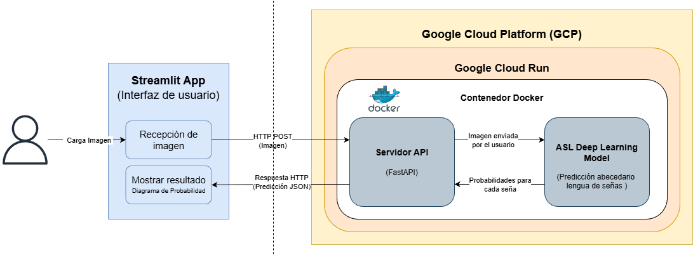

# Despliegue de modelo (FastAPI + Streamlit)

## Infraestructura Backend (FastAPI + Google Cloud Run)

- **Nombre del modelo:** asl_model
- **Plataforma de despliegue:** Google Cloud Run
- **Requisitos técnicos:** (lista de requisitos técnicos necesarios para el despliegue, como versión de Python, bibliotecas de terceros, hardware, etc.)
  - Software:
    - Python 3.12
    - Keras 3.12.0
    - TensorFlow 2.20.0
    - FastAPI 0.124.0
    - Rembg 2.0.69
    - Docker 
    - La lista completa de librerias puede encontrarse en `scripts/deployment_fastapi/requirements.txt`
  - Cloud:
    - Instancia de Google Cloud Run con 4 Gb de RAM
- **Diagrama de arquitectura:**
  

## Código de despliegue

- **Archivo principal:** `scripts/deployment_fastapi/main.py`
- **Rutas de acceso a los archivos:** `scripts/deployment_fastapi`

## Documentación del despliegue

**Instrucciones de instalación:** Para el despliegue se construye la imagen con docker y se carga a un reporsitorio en *Docker Hub* 
  - docker build -t \<usuario\>/\<repositorio\>:<\version\> .
  - docker push \<usuario\>/\<repositorio\>:<\version\> 
  
Para una ejecución local, sin docker se debe contar con python 3.12, instalar lo requisitos encontrados en `scripts/deployment_fastapi/requirements.txt` mediante `pip install -r requirements.txt` dentro de la carpeta de `deployment_fastapi`
  
**Instrucciones de configuración:** 
Se debe crear un servicio de Cloud Run y usar como imagen la cargada a Docker Hub (\<usuario\>/\<repositorio\>:<\version\>) La instancia de Cloud Run debe contar con al menos 4 Gb de RAM, ya que durante las predicciones superar el uso de 2 Gb.   

**Instrucciones de uso:** Se envian las imagenes mediante metodo POST al endpoint `/uploadfile` de la aplicación desplegada. Este retornará un JSON con información basica de la imagen así como las probabilidades generadas por el modelo para cada seña.

**Instrucciones de mantenimiento:** Dependiendo del trafico a la API del modelo y la capacidad de escalamiento configurada para la instancia de Cloud Run, se debe vigilar su disponibilidad.

## Infraestructura Frontend (streamlit)

- **Plataforma de despliegue:** Streamlit Cloud

- **Requisitos técnicos:**
  - python 3.12
  - streamlit 1.52.1
  - numpy 2.0.2
  - pandas 2.2.2
  - ImageIO 2.37.2
  - pillow 11.3.0
  - requests 2.32.4

## Código de despliegue

- **Archivo principal:** app.py
- **Rutas de acceso a los archivos:** scripts/deployment_streamlit/app.py

## Documentación del despliegue

- **Instrucciones de instalación:**

1. Creación del archivo app.py usando las librerias de streamlit para generar las características deseadas de la página web
2. Guardar el archivo requirements.txt con las librerías necesarias para ejecutar app.py
3. En Streamlit Cloud se debe especificar el repositorio de GitHub donde esta el código de despliegue (se debe ser administrador del repositorio) y definirle la ruta del archivo app.py

- **Instrucciones de configuración:**

Se utilizaron las funciones de streamlit set_page_config, title, header, divider, markdown y subheader, checkbox, button, para definir el nombre de la página, los componentes de texto de la pagina, entre otros elementos de la página web.

Adicionalmente, se utilizo la función camara_input para tomar una foto de la mano del cliente, se usa la funcion Image para abrir la foto tomada, y se guarda la foto dentro del entorno de trabajo,

Por medio del siguiente código se realizó la solicitud post hacia la arquitectura de fast-api que genera la predicción.

Por último, se entrega la respuesta de la predicción por medio de la función info y se entrega un gráfico de barras de las probabilidades generadas por el modelo por medio de la función bar_chart.

- **Instrucciones de uso:** 

1. El cliente accede a la [pagina del servicio](https://hiszc2t3rm4nq7ndvmr5ru.streamlit.app/) 
2. El cliente debe habilitar la camara por medio de un checkbox
3. Realizar una foto de la mano realizando la seña, es importante que la foto debe ser sólo para la seña y no incluir más elementos
4. La pagina web comunicara al cliente si la imagen fue almacenada correctamente
5. El cliente debe apretar el botón "Predecir"
6. La página web tomara algunos segundos en realizar una predicción, y luego arrojara la predicción de la seña junto con un gráfico de barras con las probabilidades de cada seña.

