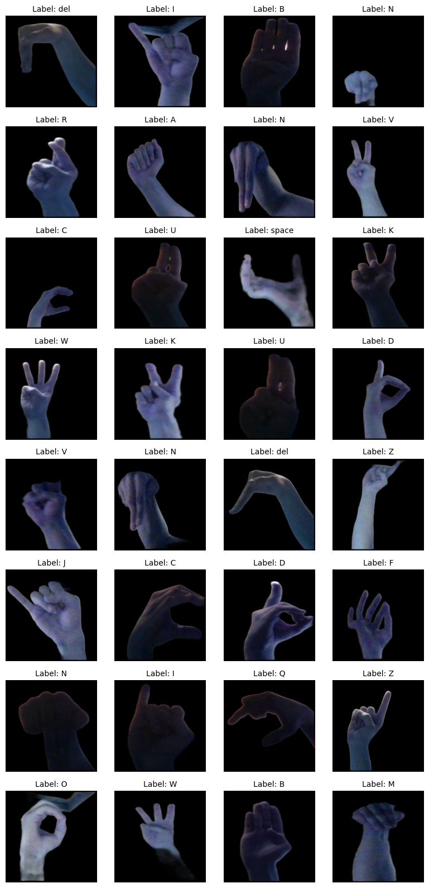
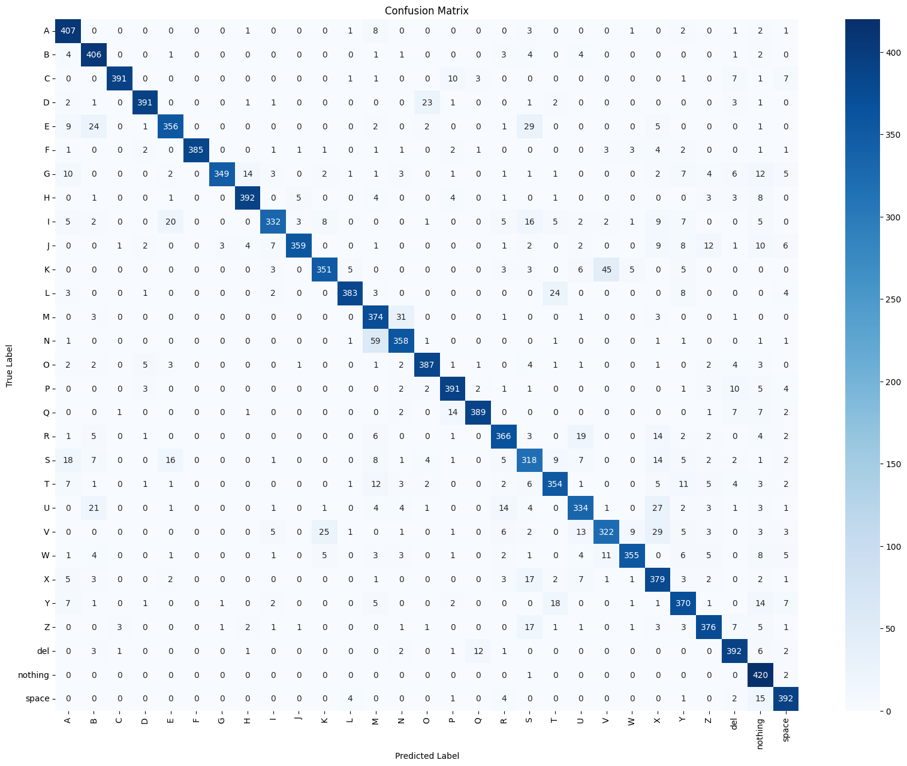

# Reporte del Modelo Baseline

Este documento contiene los resultados del modelo baseline.

---

## Descripción del modelo

Como modelo inicial se hizo uso de Transfer Learning mediante el modelo pre-entrenado *MobileNetV2*. La arquitectura se compone del extractor de *features* congelado y un cabezal de clasificación personalizado.

La arquitectura del cabezal de clasificación es la siguiente: una capa de Dropout para regularización, dos capas con activación *ReLU* y una capa de salida Softmax de 29 neuronas para las 29 clases del problema.

---

## Variables de entrada

Como variables de entrada se tienen las imágenes preprocesadas (sin fondo y aplicando Data Augmentation apropiada para el caso) de tamaño **200x200** píxeles. Adicionalmente, los hiperparámetros y la arquitectura de la cabezal de clasificación se definieron así: la capa de **dropout** se configuró con **0.2** como fracción de *dropout*, la primera capa densa consta de **512** neuronas, la segunda capa densa tiene **256** neuronas y se utilizó un learning rate de $10^{-4}$.

Estas variables e hiperparámetros se tomaron como punto de partida y modelo base.

---

## Variable objetivo

La variable objetivo son las clases correspondientes a las letras del lenguaje de señas americano (26 clases) y las señas para "**space**", "**delete**" y una clase sin señas "**nothing**", para un total de **29 clases**. En la implementación se usa un vector de 29 entradas como versión One-Hot Encoded de las 29 clases. Un ejemplo de las señas ya preprocesadas y sus correspondientes clases se muestran a continuación.

---

## Evaluación del modelo

### Métricas de evaluación

Como métricas de evaluación se utilizó el accuracy, ya que las clases se encuentran balanceadas con el mismo número de imágenes por clase, así como el F1 score.

### Resultados de evaluación

A continuación se presenta el reporte de clasificación obtenido a partir del modelo base entrenado.

| Clase | precision | recall | f1-score | support |
| :--- | :---: | :---: | :---: | :---: |
| **A** | 0.84 | 0.95 | 0.89 | 427 |
| **B** | 0.84 | 0.95 | 0.89 | 427 |
| **C** | 0.98 | 0.93 | 0.95 | 422 |
| **D** | 0.96 | 0.92 | 0.94 | 427 |
| **E** | 0.88 | 0.83 | 0.85 | 430 |
| **F** | 1.00 | 0.94 | 0.97 | 410 |
| **G** | 0.99 | 0.82 | 0.90 | 425 |
| **H** | 0.94 | 0.93 | 0.93 | 423 |
| **I** | 0.92 | 0.78 | 0.85 | 423 |
| **J** | 0.97 | 0.84 | 0.90 | 428 |
| **K** | 0.89 | 0.82 | 0.86 | 426 |
| **L** | 0.96 | 0.89 | 0.93 | 428 |
| **M** | 0.76 | 0.90 | 0.82 | 414 |
| **N** | 0.86 | 0.84 | 0.85 | 425 |
| **O** | 0.91 | 0.92 | 0.92 | 421 |
| **P** | 0.91 | 0.92 | 0.91 | 425 |
| **Q** | 0.95 | 0.92 | 0.94 | 424 |
| **R** | 0.87 | 0.86 | 0.87 | 426 |
| **S** | 0.73 | 0.76 | 0.74 | 421 |
| **T** | 0.84 | 0.84 | 0.84 | 421 |
| **U** | 0.83 | 0.79 | 0.81 | 423 |
| **V** | 0.84 | 0.75 | 0.79 | 428 |
| **W** | 0.94 | 0.85 | 0.90 | 416 |
| **X** | 0.75 | 0.88 | 0.81 | 429 |
| **Y** | 0.82 | 0.86 | 0.84 | 431 |
| **Z** | 0.89 | 0.88 | 0.89 | 425 |
| **del** | 0.87 | 0.93 | 0.90 | 421 |
| **nothing** | 0.77 | 0.99 | 0.87 | 423 |
| **space** | 0.87 | 0.94 | 0.90 | 419 |
| | | | | |
| **accuracy** | | | **0.88** | **12288** |
| **macro avg** | 0.88 | 0.88 | 0.88 | 12288 |
| **weighted avg** | 0.88 | 0.88 | 0.88 | 12288 |

A continuación también tenemos la matriz de confusión correspondiente

---

## Análisis de los resultados

El reporte de clasificación y la matriz de confusión muestran una capacidad de clasificación inicial bastante buena, con un accuracy sobre clases balanceadas del **88%**. Al ser un modelo inicial con hiperparámetros elegidos sin una estrategia de ajuste, presenta un excelente rendimiento.

El principal punto de mejora se encuentra en las clases con formas manuales similares (e.g., **S** con F1: **0.74** y **M** con F1: **0.82**).

Como punto de mejora encontramos la elección de hiperparámetros, para la cual se planea utilizar el optimizador bayesiano `Optuna`.

---

## Conclusiones

El **modelo inicial** es capaz de clasificar con un nivel aceptable las imágenes del conjunto de *testeo*, mostrando un potencial elevado para otorgar un modelo apropiado para la aplicación propuesta.
## Referencias

Akash Nagaraj. (2018). ASL Alphabet [Data set]. Kaggle. https://doi.org/10.34740/KAGGLE/DSV/29550

Sandler, M., Howard, A.G., Zhu, M., Zhmoginov, A., & Chen, L. (2018). MobileNetV2: Inverted Residuals and Linear Bottlenecks. 2018 IEEE/CVF Conference on Computer Vision and Pattern Recognition, 4510-4520.
