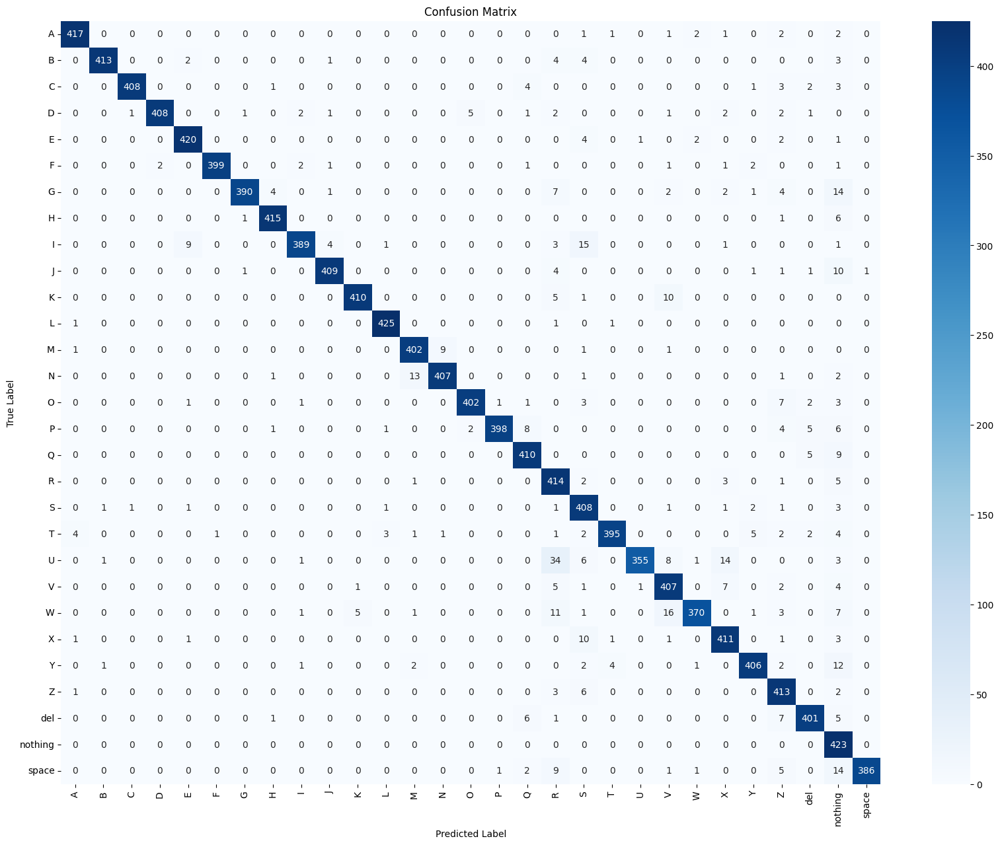

# Reporte del Modelo Final

---

## Resumen Ejecutivo

El modelo final implementado, que incluye fine-tuning sobre el *backbone* y optimización de hiperparámetros con `Optuna`, alcanzó un accuracy global del **95%** sobre el conjunto de *testeo*. Este resultado valida el sistema para la aplicación propuesta de detección automática de señas del Lenguaje de Señas Americano (ASL).

---

## Descripción del Problema

El objetivo del proyecto es desarrollar un sistema robusto y automatizado para la detección y traducción de señas visuales del abecedario del Lenguaje de Señas Americano (ASL) a texto.

El modelo opera sobre **29 categorías distintas**, incluyendo las 26 letras del alfabeto, y los comandos especiales "**space**", "**delete**" y la clase de control "**nothing**".

---

## Descripción del Modelo

El modelo final es una red neuronal convolucional que utiliza Transfer Learning a partir del modelo pre-entrenado *MobileNetV2* como extractor de features. La mejora clave es el fine-tuning, donde las últimas capas del *backbone* de MobileNetV2 fueron descongeladas y re-entrenadas.

La arquitectura se compone del *MobileNetV2* como *backbone* y un cabezal de clasificación (*custom classification head*) adjunto.

La configuración del cabezal de clasificación y los hiperparámetros resultantes de la optimización con `Optuna` son:

| Hiperparámetro | Valor optimizado |
| :--- | :--- |
| Dropout | 0.5 |
| Capa densa 1 | 384 neuronas |
| Capa densa 2 | 256 neuronas |
| Learning rate | $1.12\times10^{-4}$ |

---

## Evaluación del modelo

### Métricas de evaluación

Como métricas de evaluación se utilizó el accuracy, así como el F1 score.

### Resultados de evaluación

A continuación se presenta el reporte de clasificación obtenido del modelo final, evaluado sobre un conjunto de datos de *testeo* ($12,288$ muestras).

| Clase | precision | recall | f1-score | support |
| :--- | :---: | :---: | :---: | :---: |
| A | 0.98 | 0.98 | 0.98 | 427 |
| B | 0.99 | 0.97 | 0.98 | 427 |
| C | 1.00 | 0.97 | 0.98 | 422 |
| D | 1.00 | 0.96 | 0.97 | 427 |
| E | 0.97 | 0.98 | 0.97 | 430 |
| F | 1.00 | 0.97 | 0.99 | 410 |
| G | 0.99 | 0.92 | 0.95 | 425 |
| H | 0.98 | 0.98 | 0.98 | 423 |
| I | 0.98 | 0.92 | 0.95 | 423 |
| J | 0.98 | 0.96 | 0.97 | 428 |
| K | 0.99 | 0.96 | 0.97 | 426 |
| L | 0.99 | 0.99 | 0.99 | 428 |
| M | 0.96 | 0.97 | 0.96 | 414 |
| N | 0.98 | 0.96 | 0.97 | 425 |
| O | 0.98 | 0.95 | 0.97 | 421 |
| P | 0.99 | 0.94 | 0.96 | 425 |
| Q | 0.95 | 0.97 | 0.96 | 424 |
| R | 0.82 | 0.97 | 0.89 | 426 |
| S | 0.87 | 0.97 | 0.92 | 421 |
| T | 0.98 | 0.94 | 0.96 | 421 |
| U | 0.99 | 0.84 | 0.91 | 423 |
| V | 0.90 | 0.95 | 0.93 | 428 |
| W | 0.98 | 0.89 | 0.93 | 416 |
| X | 0.93 | 0.96 | 0.94 | 429 |
| Y | 0.97 | 0.94 | 0.96 | 431 |
| Z | 0.89 | 0.97 | 0.93 | 425 |
| del | 0.96 | 0.95 | 0.95 | 421 |
| nothing | 0.77 | 1.00 | 0.87 | 423 |
| space | 1.00 | 0.92 | 0.96 | 419 |
| | | | | |
| **accuracy** | | | **0.95** | **12288** |
| macro avg | 0.96 | 0.95 | 0.95 | 12288 |
| weighted avg | 0.96 | 0.95 | 0.95 | 12288 |

A continuación también tenemos la matriz de confusión correspondiente

---

## Análisis de los resultados

El reporte de clasificación y la matriz de confusión muestran un rendimiento excelente, con un accuracy global del **95%**. Esta mejora respecto al modelo baseline es un resultado directo del fine-tuning y la optimización de hiperparámetros.

A pesar del alto rendimiento general, las clases **R** (**F1-score**: 0.89) y **nothing** (F1-score: 0.87) persisten como las de menor rendimiento.

---

## Conclusiones y Recomendaciones

### Conclusiones

El modelo final es altamente robusto, con un accuracy del **95%**, superando el objetivo inicial y demostrando que las técnicas de Transfer Learning y fine-tuning son la estrategia óptima para este problema.

### Puntos de mejora
* **Análisis de Errores Específico:** Investigar por qué la clase **R** tiene una **precision** baja (0.82), y cómo mejorar la precision de la clase **nothing** (0.77).
* **Despliegue (Deployment):** El accuracy del **95%** justifica el paso a la fase de deployment del modelo, priorizando la eficiencia del *MobileNetV2*.

---

## Referencias

Akash Nagaraj. (2018). ASL Alphabet [Data set]. Kaggle. https://doi.org/10.34740/KAGGLE/DSV/29550

Sandler, M., Howard, A.G., Zhu, M., Zhmoginov, A., & Chen, L. (2018). MobileNetV2: Inverted Residuals and Linear Bottlenecks. 2018 IEEE/CVF Conference on Computer Vision and Pattern Recognition, 4510-4520.
